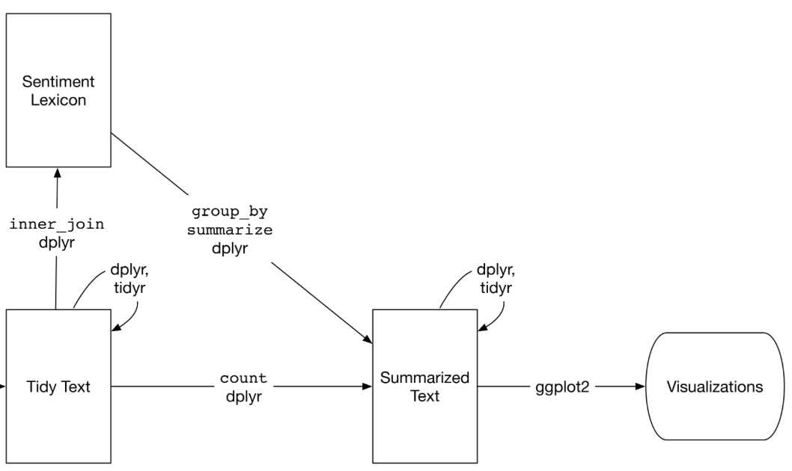

# 4. Main Analysis

## 4.1. Data cleaning

On this section, we explain the process to go from the raw data to the clean
datasets we used for the analysis. All this process can be performed using the
`./bootstrap` script.

### 4.1.1. Converting the data to a tabular format

The first step to work with the datasets was to put them in a better format
for cleaning.

The Musixmatch dataset is divided in two files .txt files (train and test),
these plain text files contain the counts for the 5,000 words. We first
converted both files to JSON using the `./txt2json` script and then combined
them in a single file, the output is has the following format:

```json
[
    {
        "track_id": "a track id"
        "bac_of_words": {
            "word_id_1": "count for word with id 1",
            "word_id_2": "count for word with id 2",
            ...
        }
    },
    ...
]
```

The raw data contains stemmed words, but the authors also provide a reverse
mapping to un-stem them. We performed that operation in the same script.

After we got the data in JSON, we convert them to a binary format, we are
using [Apache Feather](https://blog.cloudera.com/blog/2016/03/feather-a-fast-on-disk-format-for-data-frames-for-r-and-python-powered-by-apache-arrow/) since
it has good interoperability with Python and R (this JSON to Feather format
is done using the  `./bag_of_words` script). The output looks like this:

+------------------+----------------------------------+----------------------------------+
| track_id         | word_id_1                        | word_id_2                        |
+==================+==================================+==================================+
| a track id       | count for word with id 1         | count for word with id 2         |
+------------------+----------------------------------+----------------------------------+
| another track id | another count for word with id 1 | another count for word with id 2 |
+------------------+----------------------------------+----------------------------------+
| ...              | ...                              | ...                              |
+------------------+----------------------------------+----------------------------------+


The `./bag_of_words` script contains some options. The dataset contains 5,000
words in total, we can limit the output to the top k words, normalize the
counts (convert them to proportions) and remove stop words. We used these
options to generate several datasets for the analysis.

### 4.1.2. Language detection

During the first iterations of the project we noticed that it is important
to know the language of the song. For example, when analyzing which artists
are far from each other in term of the words they use, we were just seeing
difference in language. For that reason we decided to detect the language
so we could use it for our analysis.

We do this using the [langdetect](https://github.com/Mimino666/langdetect) library (this is done in the `./language_detection`) script. This script
generates a `language.feather` file that maps songs with their language.

To detect the language we take every word with non-zero count, generate a "sentence" by joining all words in a string, separating them by one space and pass the string to the  `detect()` in the `langdetect` library.

### 4.1.3. Fixing artist name and ID

We performed some cleaning in the artist name and ID. We found that for
the same artist ID, some songs had more than one artist name, this happened
when some artist had collaborations. For example, an artist with ID `A1` may
have artist names `Noel Gallagher`, `Noel Gallagher; Richard Ashcroft`, `Noel Gallagher; Richard Ashcroft; Ian Brown`. We grouped the songs by artist ID
and assigned the most common artist name to all the songs.

After cleaning the name we notice another problem: some artist names had
more than one artist ID, this happened in a small number of cases but we cleaned the data as well. We grouped the songs by artist name and assigned
the first artist ID in the group. This problem may be due to artists changing
record labels, hence, not being recognized as the same artist by the Musixmatch portal.

### 4.1.4. Extracting track metadata

There are some other datasets that contain track metadata. It is
important to mention that the Musixmatch dataset (the one with the lyrics data) is a subset of the [Million Song Dataset](https://labrosa.ee.columbia.edu/millionsong/) so we took the track IDs for such subset and only exported the metadata for those tracks.

The datasets that contain the track metadata are `track_metadata.db`
(included in the original raw data),  `msd_beatunes_map.cls` (we got that
data from [here](http://www.tagtraum.com/)) and `language.feather`. The
track metadata file is generated using the `./export_track_metadata` script and it contains the following columns (NAs information included):

* track_id - Unique identifier for the songs
* title - track title
* song_id - Another ID (undocumented)
* release - Album name
* artist_id - Artist unique ID
* artist_mid - Musixmatch artist unique ID
* artist_name - Artist name
* duration - Track duration (seconds)
* artist_familiarity - Undocumented
* artist_hottnesss - Undocumented
* release_year - Track release year (26.27% NAs)
* genre - Artist genre (17.37% NAs)
* latitude - Artist latitude (58.29% NAs)
* longitude - Artist longitude (58.29% NAs)
* location - Location string such as "New York" (58.29% NAs)
* language - Song language (0.04% NAs)

### 4.1.5. Word embeddings

Apart from using the bag of words representation, we generated a dense vector representation for each song using [word embeddings](https://en.wikipedia.org/wiki/Word_embedding), specifically, the 50 dimensional vectors in [GloVe](https://nlp.stanford.edu/projects/glove/). The process is as follows:

Every song is represented as a vector $\mathbf{c} \in \mathbb{R}^{|W|}$, where $W$ is the set of words in our dataset. Every element $\mathbf{c}_{i}$ in $\mathbf{c}$ has a word associated with it and it represents the number of times that word is mentioned in the song. To convert this to a dense vector, we first normalized it:

$$\mathbf{c}_{normalized} = \frac{\mathbf{c}}{\sum_{i=1}^{i=w}{\mathbf{c}_i}}$$


Then, using the $w \in \mathbb{R}^{50}$ dense vectors in GloVe, we built a matrix where the i-th row corresponds to the embedding for the i-th word in $|W|$, then we compute the dense vector for every song as follows:

$$\mathbf{v}_{song} = \mathbf{c}_{normalized} \times M$$

Which give us a 50 dimensional vector for every row.

### 4.1.6. Generating clean datasets

Once we cleaned the data we generated 5 final datasets:

1. `bag_of_words.feather` - Contains all the metadata and the counts for all the words (stop words removed)
2. `bag_of_words_top_1000.feather` - Contains the counts top 1,000 words with the stop words removed
3. `embeddings.feather` - Contains the metadata and the word embeddings representation (50 dimensions)
4. `profiles.csv` - Summary for artists with at least 10 songs, this is the dataset used in the interactive component

Datasets 2 and 3 are used when computing distance-based metrics to speedup computations, we assume that most of the interesting information is included in the top words. The word embeddings representation was also included since
we found it has better results for some comparisons, specifically, to compare
similarity between artists.

## 4.2. Word distribution

The required R packages for this analysis are the following:

```{r sentiment_loadPackages}
require(feather)
require(stringr)
require(tidyverse)
require(tidytext)
require(reshape2)
```

```{r loadDataset}

songsDataClean <- read_feather('../data/transform/bag_of_words_clean.feather')
```

The following word cloud is made out of the top 200 most frequent words in our dataset. We can see that the most frequent used word in this dataset are love, followed by words like time, feel, baby, yeah, heart, etc.

```{r sentiment_transformData}

songsDataEng <- songsDataClean %>% filter(language_=='en')

wordCount <- songsDataEng %>% select(-c(1:16)) %>% summarise_all(sum)

songsDataEng <- songsDataEng %>% select(-which(wordCount==0)+16)
```

```{r wordCloud}
songsDataEng
songsData %>% select(-c(1:16)) %>% summarise_all(sum) %>% tidyr::gather(key=words,value=freq) %>%
  with(wordcloud::wordcloud(words,freq,max.words = 200))
```

## 4.3. Sentiment analysis

The sentiment dataset from the TidyText package was used to obtain the sentiment for the words in our final data set. This dataset contains the following three general-purpose lexicons:

1. AFINN from Finn [Årup Nielsen](http://www2.imm.dtu.dk/pubdb/views/publication_details.php?id=6010)
2. bing from [Bing Liu and collaborators](https://www.cs.uic.edu/~liub/FBS/sentiment-analysis.html)
3. nrc from [Saif Mohammad and Peter Turney.](http://saifmohammad.com/WebPages/NRC-Emotion-Lexicon.htm)

All three of these lexicons are based on single English words. The AFINN lexicon assigns words a score between -5 and 5, with negative scores indicating negative sentiment and positive scores indicating positive sentiment. The bing lexicon categorizes the words as either positive or negative. The nrc lexicon classifies the words using the following categories: positive, negative, anger, anticipation, disgust, fear, joy, sadness, surprise, and trust. The tidytext package provides a function named get_sentiments() to get specific sentiment lexicons without the columns that are not used in that lexicon.

To perform this analysis the following data wrangling steps where conducted:

1. Filter our final dataset to get only the English songs. 
2. Remove the words in the English dataset with zero counts. 
3. Convert the dataset resulted from step 2 to tidy text format (words are in the rows, not in the columns).

Once the data was wrangled we apply a series of data transformation to get the dataset needed to generate the visualization of interest (Figure 1 illustrates this process).

{width=450px}

By adding the bing sentiment lexicon to the previous word cloud, we can see the most frequent positive and negative words. Love is the most frequent positive word used as expected, follow by words like heaven, promise, beautiful, free, smile, sweet, ext. On the negative side we can see words like die, fall, pain, wrong, hard, cry, lies, etc.

```{r sentimentWordCloud}
songsDataClean %>% select(-c(1:16)) %>% summarise_all(sum) %>% 
  tidyr::gather(key=word,value=freq) %>% inner_join(get_sentiments('bing')) %>% 
  acast(word ~ sentiment,value.var = 'freq') %>% apply(2,function(x){ifelse(is.na(x),0,x)}) %>%
  wordcloud::comparison.cloud(colors = c("#F8766D", "#00BFC4"),max.words = 200,random.order = F)
```

Using the nrc lexicon, let see how the different categories of sentiments varies across the song's release year. This graph shows that although positive words are the most frequent across all years, the gap between negative and positive seems to decreases with time. Is also relevant to mentioned that prior to 1978 the second most frequent sentiment was joy, but right after this year there seems to be a switch from joy to negative sentiments.

```{r nrcYear}
songsDataClean %>% select(9,17:ncol(songsDataEng)) %>% filter(!is.na(release_year_)) %>% 
  group_by(release_year_) %>% summarise_all(sum) %>% ungroup() %>%
  tidyr::gather(key=word,value=freq,-release_year_) %>% filter(freq>0) %>%
  inner_join(get_sentiments('nrc')) %>%
  group_by(release_year_,sentiment) %>% summarise(freq=sum(freq)) %>%
  ggplot(aes(x=release_year_,y=(freq)/1000,group=sentiment,colour=fct_reorder(sentiment,freq,.desc = TRUE))) + 
    xlim(1960,2010) + geom_line() + theme_bw() + 
    labs(colour='Sentiment',y='Frequency (Thousands)',x='Song Release Year')
```

Let see how the nrc sentiments varies not only across year but also by genre. Looking at this visualization we can see how negative sentiment not only get closer to  positives sentiments but in actually surpasses it for some genres like Electronic, Electronic/Dance, Rock and Latin. It also important to note how the negative sentiment seems to be more predominant in almost all years for genres like hardcore and hip-hop. In the Country, Gospel & Religion and World or international genres the most predominant sentiment is positive in with a high margin with non positive sentiments. The Gospel & Religion genre is the only one in which three positive sentiment are the most frequent ones (positive, trust, joy).

```{r nrcGenreYear,fig.height=12,fig.width=12}
songsDataClean %>% select(9,10,17:ncol(songsDataEng)) %>% 
  filter(!is.na(release_year_) & genre_ %in% names(sort(table(songsDataClean$genre_),decreasing = TRUE)[1:15])) %>% 
  group_by(genre_,release_year_) %>% summarise_all(sum) %>% ungroup() %>%
  tidyr::gather(key=word,value=freq,-genre_,-release_year_) %>% filter(freq>0) %>%
  inner_join(get_sentiments('nrc')) %>%
  group_by(genre_,release_year_,sentiment) %>% summarise(freq=sum(freq)) %>%
  ggplot(aes(x=release_year_,y=freq,group=sentiment,colour=fct_reorder(sentiment,freq,.desc = TRUE))) + 
    xlim(1960,2010) + geom_line() + theme_bw() +
    labs(colour='Sentiment',y='Frequency',x='Song Release Year') +
    facet_wrap(~genre_,scales = 'free_y',ncol = 3)
```

Using the AFFIN lexicon the following Cleveland Plot display the mean average sentiment score for the top 10 most popular singers per genre.  

```{r affinGenreArtist,fig.height=15,fig.width=12}
songsDataEng %>% filter(genre_ %in% names(sort(table(songsDataClean$genre_),decreasing = TRUE)[1:15])) %>%
  select(7,10,15:ncol(songsDataEng)) %>%
  plyr::ddply(.variables='genre_',
               .fun=function(x)
                {
                  y <- x %>% group_by(artist_id_) %>% summarise(popularity=max(artist_familiarity_)) %>%
                    arrange(desc(popularity))
                  y <- y[1:10,'artist_id_',drop=FALSE]
                  return(inner_join(x,y,by='artist_id_'))
                }
              ) %>% tidyr::gather(key=word,value=freq,-c(1:4)) %>% filter(freq>0) %>%
  inner_join(get_sentiments('afinn')) %>% group_by(genre_,artist_id_,artist_name_) %>%
  summarise(meanSentiment=sum(freq*score)/sum(freq)) %>% mutate(Sentiment=ifelse(meanSentiment<0,'Negative','Positive')) %>%
  ggplot(aes(y=meanSentiment,x=artist_name_,colour=)) + geom_point(aes(colour=Sentiment),size=2) + 
    coord_flip() + facet_wrap(~genre_,scales = 'free_y',ncol = 2) + theme_bw() + 
    theme(panel.grid.major.y=element_blank()) + geom_segment(aes(xend=artist_name_),yend=-4) +
    labs(y='Mean Sentiment Score',x='Artist Name')

```

## 4.4. Distance-based comparisons

One of the things we are interested on is to find which observations are more similar/different to each other. Using the word embeddings representation of
our data, we computed pairwise euclidean distance between observations at different levels to find similar elements.

Since we have more than 200,000 songs it is hard to visualize them all at once, so we need to group them in some way. For this part we decided to group based on the following columns: year, genre and artist name. When grouping songs, we took the mean of the group to represent it.

We make use of the `plot_matrix()` function which can be found in the `util.R` file. The function just computes the distance between pairs and plots them, there is also a `sort` parameter that clusters the observations and them orders them depending on the cluster they got assigned to, this helps to visualize better.

```{r}
library(feather)
library(dplyr)
library(tidyr)
library(reshape2)
library(ggplot2)
library(knitr)
source('../lib/eduardo_util.R')
```

```{r}
# load embeddings data data and
df <- read_feather('../data/transform/embeddings.feather')
bow <- read_feather('../data/transform/bag_of_words.feather')

# get columns corresponding to the metadata words
columns <- colnames(df)
columns_metadata <- columns[endsWith(columns, '_')]
columns_lyrics <- columns[!endsWith(columns, '_')]

bow_columns <- colnames(bow)
bow_columns_metadata <- bow_columns[endsWith(columns, '_')]
bow_columns_lyrics <- bow_columns[!endsWith(columns, '_')]
```

### 4.4.1. Comparing years

We first take a look at the distance between years:

```{r, fig.cap="Distance among the average song accross years"}
by_year <- df %>% group_by(release_year_) %>%
                do(mean_words(., columns_lyrics))

plot_matrix(by_year, "Release year", sort=FALSE)
```

We see that for any given year, the more we move (either to following or previous years) the distance increases. We can see that the greatest distance is between the latest data (2000s) and the earliest data (1920s).

### 4.4.2. Comparing genres

We have `r length(unique(df$genre_))` different genres in the data, so in order to visualize better we filtered by the most popular genres defined as the ones with more than 80 songs.

```{r}
# get only genres that have more than 80 songs
genre_ <- table(df$genre_)
top_genres <- names(genre_[genre_ > 80])

top_genres
```

```{r, fig.cap="Distance among average songs accross top genres"}
by_genre <- df %>% filter(genre_ %in% top_genres) %>% group_by(genre_) %>%
                do(mean_words(., columns_lyrics))

plot_matrix(by_genre, 'Song genre')
```

We see that some rows are very different to the rest: Samba, Reggaeton, MPB ([Musica popular brasileira](https://en.wikipedia.org/wiki/M%C3%BAsica_popular_brasileira)), Latin, Flamenco and Bachata. Most songs from these songs are in either Spanish or Portuguese, so it makes sense that they make use of different words.

We not filter by songs only in Spanish.

```{r, fig.cap="Distance among average songs across top genres (Spanish)"}
by_genre_es <- df %>% filter(genre_ %in% top_genres, language_ == 'es') %>%
                    group_by(genre_) %>% do(mean_words(., columns_lyrics))

plot_matrix(by_genre_es, 'Song genre (only songs in Spanish)', groups=2)
```

This plot is more informative, we see that Trance, House, Drum & Bass, Children's Music and World songs in Spanish are the genres that are most different to the rest.

We now take a look at music in English.

```{r, fig.cap="Distance among average songs across top genres (English)"}
by_genre_en <- df %>% filter(genre_ %in% top_genres, language_ == 'en') %>%
                    group_by(genre_) %>% do(mean_words(., columns_lyrics))

plot_matrix(by_genre_en, 'Song genre (only songs in English)', groups=2)
```

Here we see that Samba, Reggaeton and Bachata are the genres that are different, songs from those three genres are usually not in English, which
suggests that our language imputation algorithm is having trouble labeling
those songs.

We took a look at Reggaeton music to find out more about this problem:

```{r, fig.width=8, fig.height=6, fig.cap="Count of Reggaeton songs by language"}
reggaeton <- df %>% filter(genre_ == 'Reggaeton')

ggplot(reggaeton, aes(language_)) +
    geom_bar() +
    xlab("Language") +
    ylab("Count") +
    ggtitle("Reggaeton songs by language")
```

Most of the songs are labeled as Spanish but a couple of them in English and even one in Italian.

These are the Reggaeton songs in English:

```{r}
reggaeton_en <- bow %>% filter(genre_ == 'Reggaeton', language_ == 'en')
kable(reggaeton_en[, c('title_', 'artist_name_')])
```

If we take a look at the lyrics of any of them, we will see that they mix
a lot of English and Spanish words, see for example, this verse from "Impacto" by Daddy Yankee:

    ??Hey!
    Demuestra lo que hay, mama (¡hey!)
    No pierdas el enfoque y...
    ¡Sube! (hit me!)
    ¡Sube! (hit me!)
    ¡Sube! (hit me!, let's go!)

Since the dataset only includes the top 5,000 words across all songs, many Spanish word will not appear in the dataset but the English words will probably do. This will affect the language imputation for these songs since the non-zero counts will mostly be songs in English.

### 4.4.3. Finding similar artists

We now turn our attention to finding similar artists, to subset the number of
comparisons, we first filter by genre, language (English) and then we take the top 30 artists (the ones with the most songs)

```{r, fig.cap="Distance among Rock songs in English for the top 30 most popular artists"}
rock_en <- df %>% filter(genre_ == 'Rock', language_ == 'en')
rock_en_top <- names(sort(table(rock_en$artist_name_), decreasing=TRUE)[1:30])

by_artist <- rock_en %>% filter(artist_name_ %in% rock_en_top) %>%
                group_by(artist_name_) %>%
                do(mean_words(., columns_lyrics))

plot_matrix(by_artist, 'Top 30 Rock artists (English)', groups=2)
```

There are three bands that differ from the rest: Amorphis, Cannibal Corpse, and Napalm Death. Those three band are actually Metal bands, not Rock bands. Metal lyrics usually focus on [dark topics](https://en.wikipedia.org/wiki/Heavy_metal_lyrics), so it makes sense that those bands are different to the other bands but similar to each other.

```{r, fig.cap="Distance among Pop songs in English for the top 30 most popular artists"}
pop <- df %>% filter(genre_ == 'Pop', language_ == 'en')
pop_top <- names(sort(table(pop$artist_name_), decreasing=TRUE)[1:30])

by_artist <- pop %>% filter(artist_name_ %in% pop_top) %>%
                group_by(artist_name_) %>%
                do(mean_words(., columns_lyrics))

plot_matrix(by_artist, 'Top 30 Pop artists (English)', groups=2)
```

Here we see that Celine Dion looks brighter, meaning that her lyrics are different from the rest of the artists.

### 4.4.4. Comparing songs form the same artist

Finally, we compare songs from the two artists. First we take a look at 30 songs from the band Foo Fighters.

```{r, fig.cap="Distance among 30 songs from the Foo Fighters band"}
set.seed(10)

ff <- df %>% filter(artist_name_ == 'Foo Fighters') %>% sample_n(30)
ff <- ff[c('title_', columns_lyrics)]

plot_matrix(ff, 'Foo Fighters (30 sample songs)', groups=2)
```

We see a clear outlier here, the song ["Skin And Bones"](https://genius.com/Foo-fighters-skin-and-bones-lyrics), the chorus looks like this:


    Skin and bones
    Skin and bones
    Skin and bones, don't you know?
    Skin and bones
    Skin and bones
    Skin and bones, don't you know?

Looks like the heavy use of "skin" and "bones" is making that specific song be very different from the rest.

Now we take a look at 30 songs from The Kooks:

```{r, fig.cap="Distance among 30 songs from The Kooks band"}
set.seed(10)

kooks <- df %>% filter(artist_name_ == 'The Kooks') %>% sample_n(30)
kooks <- kooks[c('title_', columns_lyrics)]

plot_matrix(kooks, 'The Kooks (30 sample songs)', groups=2)
```

We see some black squares outside the diagonal of the matrix. those correspond to the following pairs:

```{r}
distances <- pairwise_distances(kooks, groups=2)
pairs <- distances %>% filter(row != col, Distance == 0)
kable(pairs)
```

We see that rows 1, 3 and 4 correspond to the same song but a different version so it makes sense that they have the same lyrics. The second row does not match and the songs are actually different, the counts are as follows:

```{r, fig.width=8, fig.height=6, fig.cap="Word count for two songs from The Kooks with different titles"}
titles <- c('Always Free',
            'Always Where I Need To Be (NRK P3 Acoustic Session)')
songs <- bow %>% filter(artist_name_ == 'The Kooks', title_ %in% titles)

song_1 <- top_k_words(songs, bow_columns_lyrics, row=1, k=10)
song_2 <- top_k_words(songs, bow_columns_lyrics, row=2, k=10)

df <- t(data.frame(song_1, song_2))
rownames(df) <- titles
df <- melt(df)
colnames(df) <- c('Title', 'Word', 'Count')

ggplot(df, aes(x=Word, y=Count, fill=Title)) +
    geom_bar(stat="identity", position=position_dodge()) +
    ggtitle("Two songs from The Kooks") +
    theme(axis.text.x = element_text(angle=45, hjust=1))
```

We see that both songs have the exact same counts for the top 10 words (they have actually the same counts for all words). This suggests that some of the counts may be wrong. When this dataset was created, the authors performed entity resolution between the 1 million song dataset and the Musixmatch dataset so it may be the case that some matches are wrong. Since for this particular case the artist is the same and the title is similar, they mismatched the lyrics.

## 4.5. Topic modeling

```{r}
library(feather)
library(tidyverse)

topic_artist <- read_feather('../data/transform/artist_topic_weights.feather')
topic_year   <- read_feather('../data/transform/year_topic_weights.feather')
```

Topic modeling is a powerful technique which allows for extracting the most common topics from a set of text documents (in this case song lyrics). It relies on an unstructured algorithm called Latent Dirichlet Allocation (LDA)  which finds groups of words which tend to appear in the same song. Each word is assigned a weight according to its relation to each topic. It is up to human discretion to name the groups of words.

This was used to identify topics within our data. After finding 25 topics, by considering the most heavily weighted words, 3 topics with semantic meaning were identified: Love, Religion, and Death.

Here are the top 10 weighted words in each topic with clear semantic meaning:

* Love: love, heart, sweet, true, give, enough, darling, touch, vision, found
* Death: life, die, run, dead, kill, dream, blood, death, scream, clear
* Religion: us, god, live, dance, people, heaven, hand, stand, angel, beautiful

Using these topic weights, each song can be scored to show how prevalent each topic is. In order to account for songs with many more words than others, these topic scores are divided by the number of words in each song to ensure correct equivalent scaling. However, just because a song has a higher religion score than death score does not mean it is more about religion, therefore, we must scale each topic to lie within common bounds. To do this, each song's topic score is ranked according to its sorted order, and then the ranking is scaled between 0 and 1.

Now we can begin to answer some fundamental questions with the topic data:

* Do topics change around the world?
* Have topics changed over time?

### 4.5.1. How have topics changed over time?

Here each year's songs topic weights were averaged. As we have seen previously, the number of songs each year in the dataset has generally grown over time. Thus it makes sense that we see a lot of noise in earlier years. Once sufficient data is available (around 1955), we can start to make observations.

* Love Songs have become less popular since the 1950's
* Songs about religion and death have become more popular since the 1950's
* In general, topics have become more consistent each year (based on preprocessing, each topic's mean lies at 0.5, and all topics approach 0.5 over time).

```{r}
df_parallel_coord <- data.frame(t(topic_year))[1:3,]
colnames(df_parallel_coord) <- topic_year$year
df_parallel_coord$topic<-rownames(df_parallel_coord)

GGally::ggparcoord(df_parallel_coord,
                   scale='globalminmax',
                   columns = 1:87,
                   groupColumn='topic') +
  theme(text = element_text(size=5),axis.text.x = element_text(angle=90, hjust=1))+
  xlab('Year') +
  ylab('Topic Average Weight')+
  ggtitle('Topics Over Time')
```

```{r}
df_parallel_coord <- data.frame(t(topic_year))[1:3,]
colnames(df_parallel_coord) <- topic_year$year
df_parallel_coord$topic<-rownames(df_parallel_coord)

GGally::ggparcoord(df_parallel_coord,
                   scale='globalminmax',
                   columns = 32:87,
                   groupColumn='topic')+
  theme(text = element_text(size=10),axis.text.x = element_text(angle=90, hjust=1))+
  xlab('Year') +
  ylab('Topic Average Weight')+
  ggtitle('Topics Over Time (when sufficient data available)')
```

### 4.5.2 How do topics differ across the world?

To consider topics across geography, we first explore the location of artists in the dataset: Artists are scattered around the globe, with major "hubs" being the USA and Europe (particularly the UK).

```{r}
topic_loc_tidy <- gather(topic_artist, 'topic', 'weight', c(3,6,7))
topic_loc_tidy$topic <- as.factor(topic_loc_tidy$topic)

ggplot(topic_loc_tidy) +
  borders("world", colour="gray50", fill="gray80") +
  geom_point(aes(x=longitude, y=latitude) , color = 'red', size=0.1, alpha=.25)+
  ggtitle('Artist Location')
```

In order to investigate topics around the world, each artist's topic scores are averaged. Only artists maintaining an average score of over 0.75 for a particular topic are considered to consistently discuss that topic.  By using this cutoff, have we defined approximately 11% of artists to speak heavily about death, ~14% of artists to speak heavily about love, and 11% of artists to speak heavily about religion. 

Primary observations:

* Love is the most common topic to define an artist's content.
* Europe sees far more artists discussing death, particularly Germany.
* The United States is dominated by artists discussing love and religion, with few discussing death. 

```{r}
data_to_plot <- select(topic_loc_tidy, longitude, latitude, topic, weight) %>%
  filter(weight>0.75)

bardata <- data_to_plot %>% group_by(topic) %>% summarize(count = n())

ggplot(bardata, aes(x = reorder(topic, count), y=count))+
  geom_col() + 
  ggtitle('Artists Count Consistently Referring to a Particular Topic')+
  xlab('Topic')+
  ylab('Count')

```

```{r}
ggplot(data_to_plot) +
  borders("usa", colour="gray50", fill="gray80") +
  geom_jitter(aes(x=longitude, y=latitude, color=topic) , size=1, alpha=.4)+
  xlim(-125, -67)+
  ylim(25,50)+
  ggtitle('"Topic Heavy" Arists in USA')
```

```{r}
ggplot(data_to_plot) +
  borders("world", colour="gray50", fill="gray80") +
  geom_point(aes(x=longitude, y=latitude, color=topic) , size=1, alpha=.5)+
  coord_fixed(ratio = 1)+
  xlim( -10, 40)+
  ylim(40,75)+
  ggtitle('"Topic Heavy" Arists in Europe')

```

### 4.5.3 Topic Related Hypotheses and Next Steps

* We hypothesize that love songs have become relatively less popular over the past decades because more topics are now desirable to the audience to be discussed in music.
* Topic modeling in individual years (or decades). Considering music from over the course of almost a century only allows for easily identifying topics which have always been discussed. By modeling topics from specific time-frames, we may be able to understand which unique topics only existed during specific points in history. Similarly, topic modeling could be performed in specific locations. Maybe there are region specific topics which were not weighted heavily enough to be identified when considering data from around the world.
* The data suggests that the are a lot of artists discussing death in Europe and particularly Germany. We could perform  topic modeling on other documents coming from these countries (like books perhaps) to see if this trend is limited to music, or the country's entire culture.
